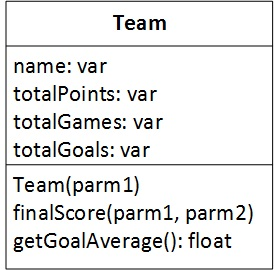
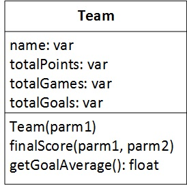

# Week 6 Lab

Clone this repo into your www folder under laragon. In the command prompt, cd into the \laragon\www folder. Make sure that you are in the correct folder and that laragon\www appears in the command prompt. Type git clone your-repo-url (Get your repo url from github after creating the repo). Then cd into the folder you have just cloned by typing cd week6Lab-yourgithubid. Once you are in the correct folder, keep this command window open so you can type in your git commands as required.

This lab includes a number of steps to create a new PHP class to control football Teams and their results. By the end of this lab students will be able to:

- create a PHP class from a UML description
- Take values from a HTML form and use them to instantiate a PHP class
- use the methods of a PHP class to process data relating to the class

# Part 1

Create a PHP file containing the following UML class. Assume the constructor takes the team name as a parameter. The finalScore method indicates the score of a match played against an opposing team. The first parameter of the final score method indicates the home team's score in the game. The second parameter indicates the opposing team's score. Using this method it is possible to calculate whether the home Team won lost or drew. Based on this, the finalScore method should add three points to the total points if the team won. One point should be added for a draw, and no points should be added for a loss. In addition to calculating points, the finalScore method should add the goals scored (from the first parameter) to the totalsGoals attribute. The finalScore method should also increase the totalGames by one (**hint use += operator to add one to the value stored in a variable**)

Remember you must use the **$this** variable together with the **arrow operator** when accessing class variables from within the methods of the class. See the slides on this.
When you have completed the Team.php class save it to your repo folder and test it using the teamTester.php program. To do this type ***php teamTester.php*** into the Command Line Interface.

# Part 2

Add a method called getGoalAverage() to your class as follows

The goal average should merely return the average number of goals scored so far this season. This is the total number of goals divided by the total number of games. Bear in mind that these figures are available as attributes of the class but to access them you must use $this together with the arrow operator.  To test Part 2 type ***php testPart2.php*** into the command line, if your code is correct you should get a goal average of 2.

# Part 3

The html file **matchResults.html** gets the results of three different fixtures and passes them to a program called processScores.php using the **GET** method. Create this file called **processScores.php** and add it to your repo. The file should gather the teamName submitted by the user and assign it to a simple PHP variable. This variable should be used to instantiate a Team.php class and assign it to a PHP variable called $homeTeam. In order to do this you must first use the include statement to include the code from Team.php in your class. Once you have instantiated the object, you will need to call the finalScore method against your $homeTeam variable three separate times for each of the three separate results. Hint - use the arrow operator as follows ***$homeTeam->finalSore($ht1,$at1);*** three separate times for each of the three separate results. Replace the $ht1, and $at1 arguments with the simple PHP variables you have used to store the home team and away team scores which you retrieved from the form data submitted.

When you have added each of the three match results, echo the goal average of the Team to the screen by calling the getGoalaverage() function on the $homeTeam variable. Is the average correct? For example, if the user entered that the home team scored 3 goals in the first game, 2 in the second and 1 in the third the average should be 2. 

