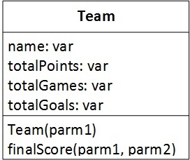

# Week 6 Lab

Clone this repo into your www folder under laragon. In the command prompt cd into the \laragon\www folder. Make sure that you are in the correct folder and that laragon\www appears in the command prompt. Type git clone your-repo-url (Get your repo url from github after creating the repo). Then cd into the folder you have just cloned by typing cd week6Lab-yourgithubid. Once you are in the correct folder, keep this command window open so you can type in your git commands as required.

This lab includes a number of steps to create a new PHP class to control football Teams and their results. By the end of this lab students will be able to:

- create a PHP class from a UML description
- Take values from a HTML form and use them to instantiate the Team class
- use the methods of the Team class to process data relating to the Team

# Part 1

Create a PHP file containing the following UML class.

